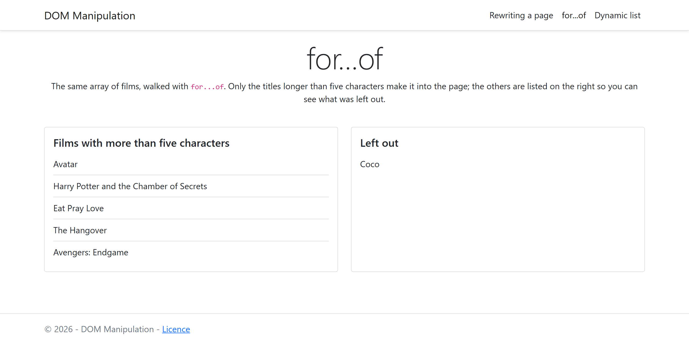
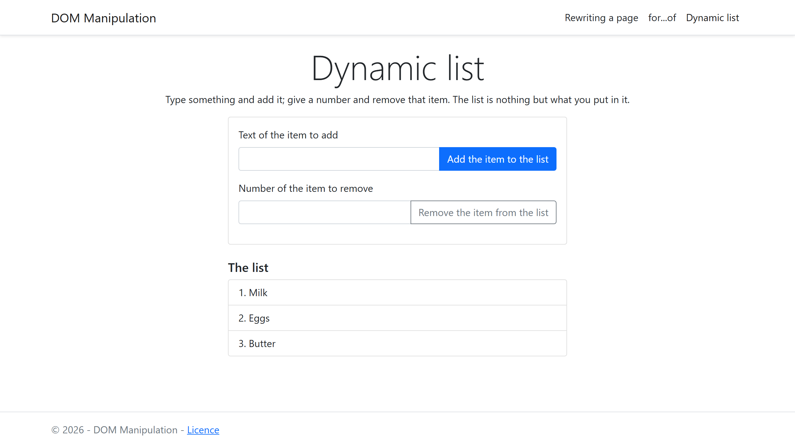
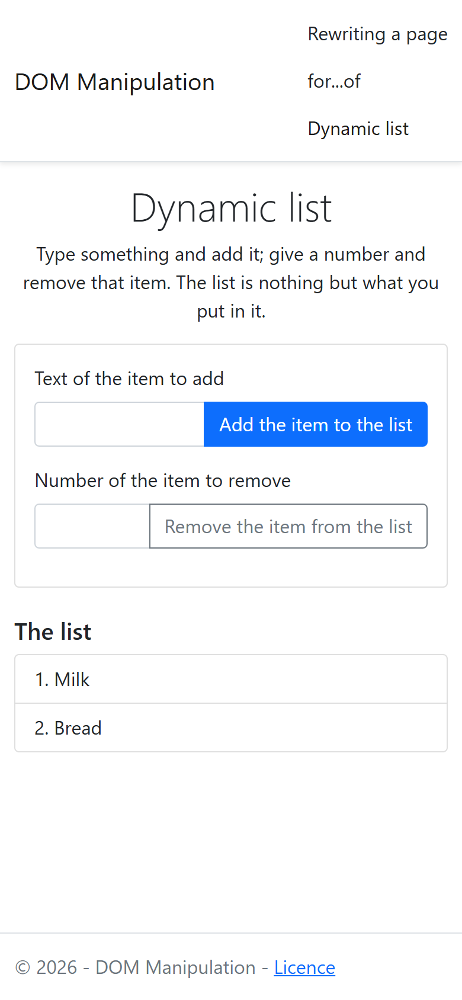

# dom-manipulation

Three pages that change themselves from JavaScript, with nothing written as
HTML text. One rewrites a section at load: a heading removed, attributes set,
a menu entry inserted first, a list generated from an array. One walks the
same array with `for...of` and keeps only the longer titles. One is a list
you build yourself, adding by text and removing by number.

HTML, Bootstrap for the layout, and vanilla JavaScript. No build step, no
JavaScript library: open any of the three files.

## Screenshots

## How it works

**Find, remove, set, create, insert.** The first page's script does the five
basic moves in order: `querySelector` then `remove()` on the heading,
`setAttribute` for the menu's `aria-label` and the field's `type` and
`required`, `createElement` plus `prepend` for the Home entry, and a loop of
`createElement` plus `append` for the films. Each move writes one line into
the card beside the sample, so what changed is visible without opening the
inspector.

**`for...of` reads values, not indexes.** The second page walks the films
array with `for (const film of films)` and tests `film.length` on each; a
title over five characters goes into the main list, a shorter one into the
side list, so the filter is checked rather than trusted.

**A list that is only what you put in it.** The third page's Add button is
the form's submit button, so Enter in the text field adds too; the form
handler calls `preventDefault` and the page never reloads. Remove reads a
one-based number, converts it to the zero-based `children` index, and
refuses anything out of range with a message that states the current range.
Empty text is refused as well.

**Nothing is written as markup.** Every element is created with
`createElement` and filled with `textContent`, so a typed value can never be
interpreted as HTML.

## Running it

Open `index.html`, `for-of.html` or `dynamic-list.html` in a browser. The
navigation bar links the three. There is nothing to install.

## Stack

HTML, Bootstrap 5.1 for the layout, and vanilla JavaScript. Three scripts,
no stylesheet of its own, no JavaScript library.

## Résumé

Trois pages qui se modifient elles-mêmes en JavaScript, sans jamais écrire
de HTML sous forme de texte. La première réécrit une section au chargement :
titre retiré, attributs posés, entrée de menu insérée en premier, liste
générée depuis un tableau, chaque geste étant noté dans une carte à côté. La
deuxième parcourt le même tableau avec `for...of` et ne garde que les titres
de plus de cinq caractères, les autres étant montrés à part. La troisième est
une liste que l'on construit soi-même, ajout par texte et retrait par numéro,
avec un refus explicite pour un texte vide ou un numéro hors de la plage ;
le bouton d'ajout soumet le formulaire, donc la touche Entrée ajoute aussi.
Tous les éléments sont créés par `createElement` et remplis par
`textContent`.

## Licence

MIT. See [LICENSE](LICENSE).
